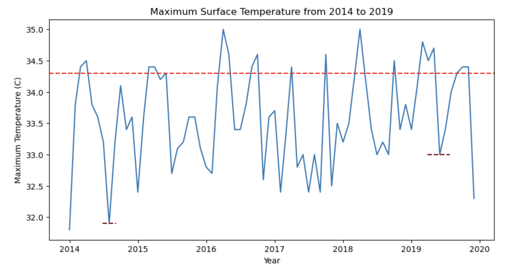
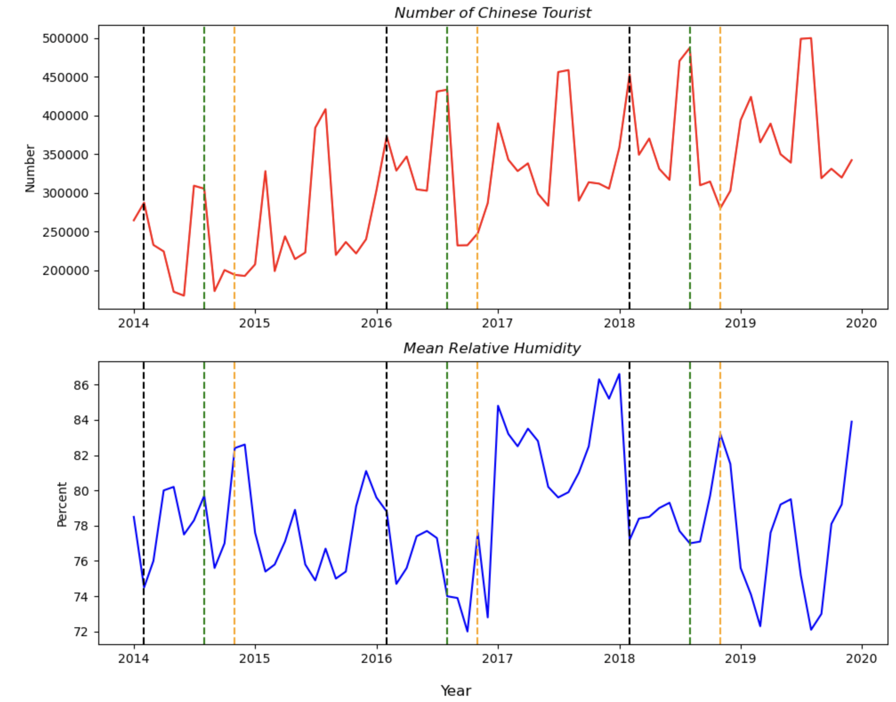

# Are tourists avoiding Singapore due to its changing weather and climate?
by Liyena Yusoff

With the changes in the climate over the years, the tourism industries in different countries are negatively hit by the effects of the changing climate.

We want to investigate whether the changes in the Singaporean climate affects the number of tourists coming to Singapore. 

## Datasets

 1. Rainfall Monthly Number of Rain Days (given)
 2. Rainfall Monthly Total (given)
 3. [Relative Humidity - Monthly Mean](https://beta.data.gov.sg/datasets/1404/view)
 4. [Surface Air Temperature - Monthly Absolute Extreme Maximum](https://beta.data.gov.sg/datasets/1371/view)
 5. [International Visitor Arrivals By Inbound Tourism Markets](https://tablebuilder.singstat.gov.sg/table/TS/M550001)

## Key Data Cleaning Steps

- Merged datasets
- Renamed column names
- Changed column data type

## Data Dictionary

|Feature|Type|Dataset|Description|
|---|---|---|---|
|no_of_rainy_days|integer|rainfall-monthly-number-of-rain-days|Number of days with rainfall by month|
|total_rainfall|float|rainfall-monthly-total|Total rainfall in mm| 
|mean_rel_humid|float|RelativeHumidityMonthlyMean|Percentage of the mean relative humidity|
|max_temperature|float|SurfaceAirTemperatureAbsoluteExtremeMaximum|The maximum air temperature in Celsius by month|
|total_intl_arr|integer|intl_visitor_arrival_continent|The number of inbound visitors to Singapore by continents|
|SEA|integer|intl_visitor_arrival_continent|The number of inbound visitors from South-East Asian countries|
|china|integer|intl_visitor_arrival_continent|The number of inbound visitors from China|
|north_asia|integer|intl_visitor_arrival_continent|The number of inbound visitors from Russia & Russian Federal Districts|
|south_asia|integer|intl_visitor_arrival_continent|The number of inbound visitors from South Asian countries|
|west_asia|integer|intl_visitor_arrival_continent|The number of inbound visitors from the Middle Eastern countries|
|americas|integer|intl_visitor_arrival_continent|The number of inbound visitors from North & South America|
|europe|integer|intl_visitor_arrival_continent|The number of inbound visitors from Europe|
|oceania|integer|intl_visitor_arrival_continent|The number of inbound visitors from Australia, New Zealand and Polynesian countries|
|africa|integer|intl_visitor_arrival_continent|The number of inbound visitors from African countries|

## Exploratory Data Analysis

- The minimum total rainfall was 0.2mm on Feb 2014
- The maximum total rainfall was 765.9mm on Dec 2006
- The maximum total rainfall usually falls during the monsoon season between November to January and this decreased from 2012
- The minimum total rainfall falls in either February or in June during the dry season.
- The highest maximum surface temperature was 35.5 degree celcius in Mar 2010
- The lowest maximum surface temperature was 31.8 degree celcius in Dec 2007 and Jan 2014.
- The highest maximum surface temperature falls in the inter-monsoon season and ranges between 33 and 35.5 degrees celcius
- The lowest maximum surface temperature falls in the wet season but in 2012 and 2018, the lowest maximum surface temperature falls during the dry season.
- There were some outliers in the total_rainfall data
- Moderate correlation between the length of total rainfall and the total number of international arrivals, the number of tourists from China and the number of tourists from North Asia

## Visualisations

## Conclusion / Recommendations

In conclusion, the number of inbound tourists to Singapore remains generally unaffected by the changes in the Singaporean climate.

However, from the analysis, as humidity increases, the number of tourists from China and North Asia decreases. Even though there is a weak positive correlation between the humidity level and the total rainfall, we can interpret that these tourists favor coming to Singapore during the dryer seasons.

During the dry seasons, the Singapore Tourism Board can organise outdoor activities and programmes as well as offers to tourist attractions such as the Singapore Zoo, the Universal Studios Singapore or the Gardens by The Bay as well as programmes along neighborhoods like The Civic District, to attract significantly more tourists. 

On wet seasons, the STB can promote indoor activities such as a trip to the indoor flower gardens, the indoor VR theme park and museum exhibitions.

